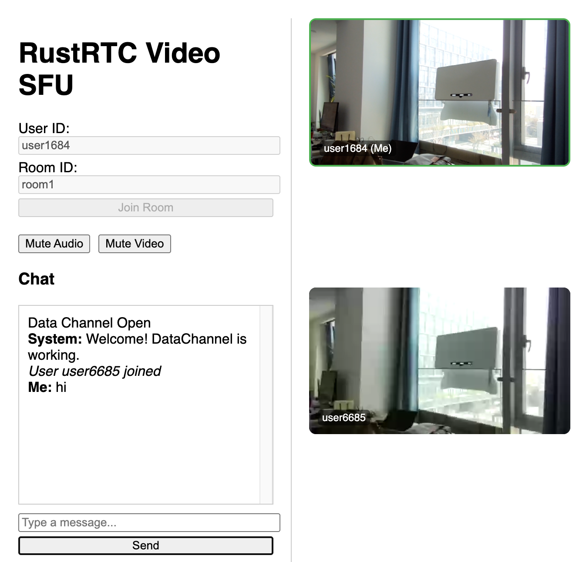

# rustrtc

[](https://crates.io/crates/rustrtc)
[](https://docs.rs/rustrtc)

A high-performance implementation of WebRTC.

## Features

- **🚀High performance:** ~2.8x faster than `pion` (go version).
- **🍡WebRTC Compliant**: Full compliance with webrtc/chrome.
- **📺Media Support**: RTP/SRTP handling for audio and video.
- **👌ICE/STUN**: Interactive Connectivity Establishment and STUN protocol support.

## Benchmark game (rustrtc vs webrtc-rs & pion) in 0.2.28

**CPU:**  `AMD Ryzen 7 5700X 8-Core Processor`
**OS** `5.15.0-118-generic #128-Ubuntu`  
**Compiler** `rustc 1.91.0 (f8297e351 2025-10-28)`,  `go version go1.23.0 linux/amd64`

```shell
nice@miuda.ai rustrtc % cargo run -r --example benchmark

Comparison (Baseline: webrtc)
Metric               | webrtc     | rustrtc    | pion      
--------------------------------------------------------------------------------
Duration (s)         | 10.07      | 10.02      | 10.13     
Setup Latency (ms)   | 1.36       | 0.22       | 0.90      
Throughput (MB/s)    | 254.55     | 713.66     | 309.11    
Msg Rate (msg/s)     | 260659.38  | 730788.92  | 316533.37 
CPU Usage (%)        | 1480.45    | 1497.50    | 1121.20   
Memory (MB)          | 29.00      | 15.00      | 44.00     
--------------------------------------------------------------------------------

Performance Charts
==================

Throughput (MB/s) (Higher is better)
webrtc     | ██████████████                           254.55
rustrtc    | ████████████████████████████████████████ 713.66
pion       | █████████████████                        309.11

Message Rate (msg/s) (Higher is better)
webrtc     | ██████████████                           260659.38
rustrtc    | ████████████████████████████████████████ 730788.92
pion       | █████████████████                        316533.37

Setup Latency (ms) (Lower is better)
webrtc     | ████████████████████████████████████████ 1.36
rustrtc    | ██████                                   0.22
pion       | ██████████████████████████               0.90

CPU Usage (%) (Lower is better)
webrtc     | ███████████████████████████████████████  1480.45
rustrtc    | ████████████████████████████████████████ 1497.50
pion       | █████████████████████████████            1121.20

Memory (MB) (Lower is better)
webrtc     | ██████████████████████████               29.00
rustrtc    | █████████████                            15.00
pion       | ████████████████████████████████████████ 44.00
```

**Key Findings:**

- **Throughput**: `rustrtc` is ~2.8x faster than `webrtc-rs` and ~2.3x faster than `pion`.
- **Memory**: `rustrtc` uses ~48% less memory than `webrtc-rs` and ~66% less than `pion`.
- **Setup Latency**: Significantly faster connection setup (0.22ms vs 1.36ms/0.90ms).

## Usage

Here is a simple example of how to create a `PeerConnection` and handle an offer:

```rust
use rustrtc::{PeerConnection, RtcConfiguration, SessionDescription, SdpType};

#[tokio::main]
async fn main() {
    let config = RtcConfiguration::default();
    let pc = PeerConnection::new(config);

    // Create a Data Channel
    let dc = pc.create_data_channel("data", None).unwrap();

    // Handle received messages
    let dc_clone = dc.clone();
    tokio::spawn(async move {
        while let Some(event) = dc_clone.recv().await {
            if let rustrtc::DataChannelEvent::Message(data) = event {
                println!("Received: {:?}", String::from_utf8_lossy(&data));
            }
        }
    });

    // Create an offer
    let offer = pc.create_offer().unwrap();
    pc.set_local_description(offer).unwrap();

    // Wait for ICE gathering to complete
    pc.wait_for_gathering_complete().await;

    // Get the complete SDP with candidates
    let complete_offer = pc.local_description().unwrap();
    println!("Offer SDP: {}", complete_offer.to_sdp_string());
}
```

## Configuration

`rustrtc` allows customizing the WebRTC session via `RtcConfiguration`:

- **ice_servers**: Configure STUN/TURN servers.
- **ice_transport_policy**: Control ICE candidate gathering (e.g., `All`, `Relay`).
- **ssrc_start**: Set the starting SSRC value for local tracks.
- **media_capabilities**: Configure supported codecs (payload types, names) and SCTP ports.

```rust
use rustrtc::{PeerConnection, RtcConfiguration, IceServer, IceTransportPolicy, config::MediaCapabilities};

let mut config = RtcConfiguration::default();

// Configure ICE servers
config.ice_servers.push(IceServer::new(vec!["stun:stun.l.google.com:19302"]));

// Set ICE transport policy (optional)
config.ice_transport_policy = IceTransportPolicy::All;

config.ssrc_start = 10000;

// Customize media capabilities
let mut caps = MediaCapabilities::default();
// ... configure audio/video/application caps ...
config.media_capabilities = Some(caps);

let pc = PeerConnection::new(config);
```

### SCTP (DataChannel) tuning

`rustrtc` exposes a few SCTP knobs that can be useful for high-latency or
rate-limited links (e.g., TURN relays). All values live on `RtcConfiguration`:

- `sctp_max_cwnd` (bytes): upper bound for congestion window growth.
- `sctp_max_burst` (packets): per-tick send burst limiter. `0` uses a heuristic (16 packets normal, 4 in recovery).
- `sctp_unlimited_burst_non_recovery` (bool): when `true` and `sctp_max_burst == 0`, disables burst limiting outside recovery (avoids adding an extra RTT for payloads that already fit within `cwnd`).
- `sctp_initial_cwnd` (bytes): initial congestion window. `0` uses the library default.
- `sctp_slow_start_increase_cap` (bytes): caps the cwnd increase per SACK during slow start. `0` uses the effective initial cwnd.
- `sctp_gap_sack_delay_srtt_divisor` (u32): when non-zero, delays gap SACKs by `srtt / divisor` (internally clamped). `0` disables the delay.
- `sctp_diag_enabled` (bool): enables verbose SCTP diagnostics at `info` level (target: `rustrtc::sctp_diag`).
- `sctp_no_sack_sig_gating` (bool): debug knob to count missing reports even on duplicate SACKs (can make loss detection more aggressive).

```rust
use rustrtc::RtcConfigurationBuilder;
use std::time::Duration;

let config = RtcConfigurationBuilder::new()
    .sctp_max_cwnd(512 * 1024)
    .sctp_max_burst(0)
    .sctp_unlimited_burst_non_recovery(true)
    .sctp_initial_cwnd(12_000)
    .sctp_slow_start_increase_cap(12_000)
    .sctp_gap_sack_delay_srtt_divisor(2)
    // .sctp_diag_enabled(true) // troubleshooting
    .sctp_rto_initial(Duration::from_millis(1200))
    .sctp_rto_min(Duration::from_millis(600))
    .build();
```

## Examples

You can run the examples provided in the repository.

### SFU (Selective Forwarding Unit)

A multi-user video conferencing server. It receives media from each participant and forwards it to others.

1. Run the server:

    ```bash
    cargo run --example rustrtc_sfu
    ```

2. Open your browser and navigate to `http://127.0.0.1:8081`. Open multiple tabs/windows to simulate multiple users.



### Echo Server

The echo server example demonstrates how to accept a WebRTC connection, receive data on a data channel, and echo it back. It also supports video playback if an IVF file is provided.

1. Run the server:

    ```bash
    cargo run --example echo_server
    ```

2. Open your browser and navigate to `http://127.0.0.1:3000`.

### DataChannel Chat

A multi-user chat room using WebRTC DataChannels.

1. Run the server:

    ```bash
    cargo run --example datachannel_chat
    ```

2. Open your browser and navigate to `http://127.0.0.1:3000`. Open multiple tabs to chat between them.

### Audio Saver

Records audio from the browser's microphone and saves it to a file (`output.ulaw`) on the server.

1. Run the server:

    ```bash
    cargo run --example audio_saver
    ```

2. Open your browser and navigate to `http://127.0.0.1:3000`. Click "Start" to begin recording.

### RTP Play (FFmpeg)

Streams a video file (`examples/static/output.ivf`) via RTP to a UDP port, which can be played back using `ffplay`.

1. Run the server:

    ```bash
    cargo run --example rtp_play
    ```

2. In a separate terminal, run `ffplay` (requires ffmpeg installed):

    ```bash
    ffplay -protocol_whitelist file,udp,rtp -i examples/rtp_play.sdp
    ```

## License

This project is licensed under the MIT License.
